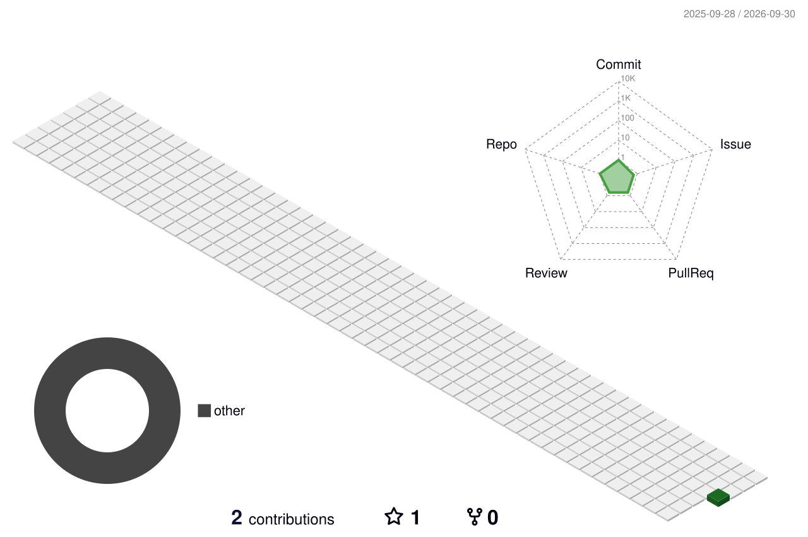

<!-- Snake eating your contribution graph (generated by grid-snake.yml into the `output` branch) -->
<picture>
  <source media="(prefers-color-scheme: dark)" srcset="https://raw.githubusercontent.com/paralojarrad/paralojarrad/output/github-contribution-grid-snake-dark.svg">
  
</picture>

### Hi, I'm Jarrad 👋

<!-- Hosted stat cards: no setup, just image URLs -->

  
  

  

  

<!-- 3D contribution calendar (generated by profile-3d.yml into profile-3d-contrib/) -->
<picture>
  <source media="(prefers-color-scheme: dark)" srcset="profile-3d-contrib/profile-night-rainbow.svg">
  
</picture>

