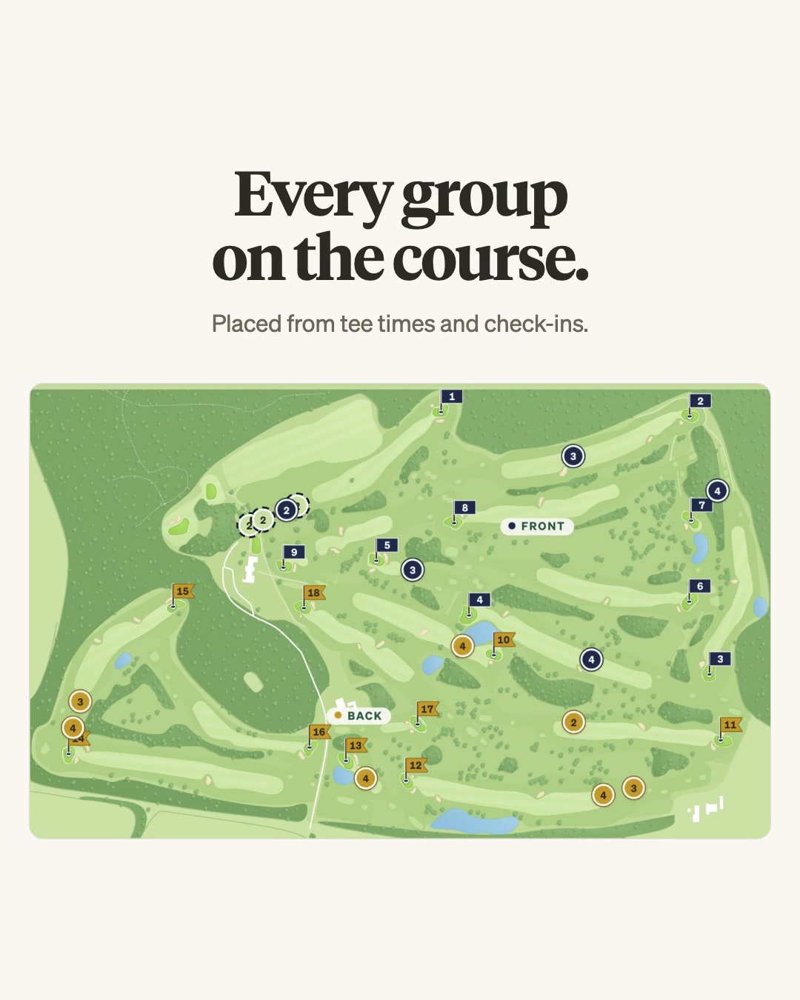

<picture>
  <source media="(prefers-color-scheme: dark)" srcset="assets/header-dark.svg">
  
</picture>

I'm Jarrad, co-founder and CEO of [Paralo](https://getparalo.com). We build the operating system for private members' golf clubs: tee sheet, competitions, live scoring, the member app on phone and wrist, EPOS, finance. One integrated system, built from scratch, hosted in the UK.

Most of the work lives in private repositories. The cadence does not.

<picture>
  <source media="(prefers-color-scheme: dark)" srcset="assets/shipping-dark.svg">
  
</picture>

<picture>
  <source media="(prefers-color-scheme: dark)" srcset="https://raw.githubusercontent.com/paralojarrad/paralojarrad/output/snake-dark.svg">
  
</picture>

<table>
  <tr>
    <td width="33%"></td>
    <td width="33%"></td>
    <td width="33%"></td>
  </tr>
</table>

### Where it runs

| Surface | What it does |
| --- | --- |
| **ClubOS** | The club's control plane. Tee sheet, competitions, membership, comms, finance. |
| **Member app** | iPhone, Apple Watch and widgets. Scoring, booking, leaderboards. Quiet by design. |
| **EPOS** | The till in the bar and pro shop, on the same member accounts as everything else. |
| **Clubhouse screens** | Live leaderboards and tee boards. |
| **Club website** | Designed and built in-house, sharing one spine with the club system. |

<picture>
  <source media="(prefers-color-scheme: dark)" srcset="assets/commits-dark.svg">
  
</picture>

Every club will end up on one system. We're making sure it's this one.

[getparalo.com](https://getparalo.com) · [jarrad@getparalo.com](mailto:jarrad@getparalo.com)
